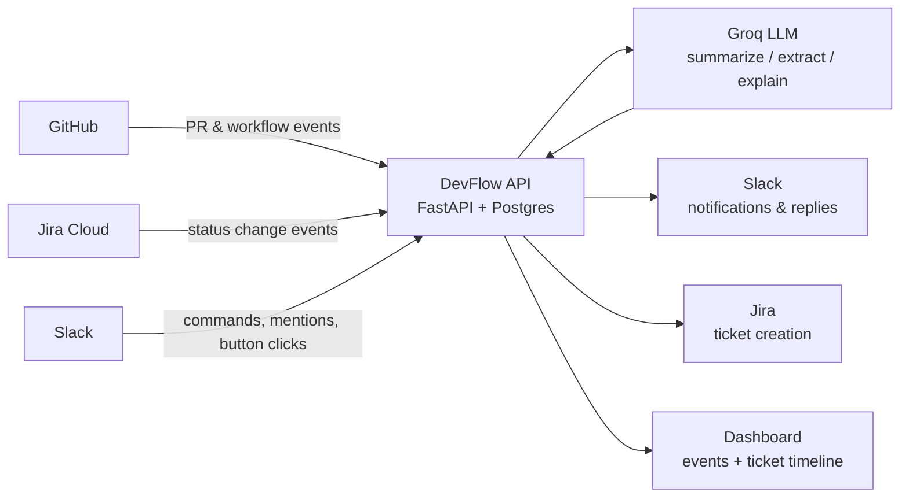

# DevFlow AI


[](LICENSE)

**Event-driven engineering automation that connects GitHub, Jira, and Slack — with an AI layer
that summarizes PRs, explains CI failures, turns Slack threads into Jira tickets (with human
approval), and answers natural-language status questions.**

🔗 **Live demo:** [devflow-api-3tiw.onrender.com](https://devflow-api-3tiw.onrender.com/dashboard)
*(free-tier hosting — sleeps after 15 min idle, first load may take ~30-50s to wake up)*

See [devflow-ai-project-idea.md](devflow-ai-project-idea.md) for the full product vision and
[RESOURCES.md](RESOURCES.md) for the account/API setup + deployment checklist.

## Highlights

- **Deterministic logic and AI logic are kept separate.** Ticket-key correlation, webhook
  auth, and event routing are plain code; the LLM (Groq) is only used for genuinely
  judgment-shaped tasks — summarization, structured extraction, and natural-language answers.
- **The AI layer degrades gracefully.** Every LLM call is wrapped so a Groq outage or bad
  response never breaks the underlying feature — a PR still gets posted to Slack even if its
  AI summary fails, with the failure fully logged, not swallowed.
- **Human approval on the one AI action with real side effects.** Turning a Slack thread into
  a Jira ticket shows an editable preview with Approve/Cancel buttons before anything is
  created — the AI drafts, a person confirms.
- **Webhook idempotency.** GitHub, Jira, and Slack all retry webhook deliveries on
  timeout/non-2xx responses in production; duplicate deliveries are detected by provider
  delivery ID and short-circuited before any Slack post, Jira write, or Groq call fires twice.
- **Two real integration bugs, fixed for real:** Slack's 3-second interaction timeout required
  redesigning the Jira-ticket flow to ack immediately and follow up via `response_url`; a
  reasoning-model token-starvation bug (Groq's `gpt-oss` spending its entire token budget on
  hidden reasoning and returning empty content) was fixed with `reasoning_effort: "low"`.
- **Tested at the right layer.** Prompt-construction and job/step-filtering logic is unit
  tested directly (mocking only the LLM call), while webhook integration tests cover full
  request→Slack/Jira round trips with all outbound HTTP mocked via `respx` — 65 tests, no
  live credentials needed, running in CI on every push.

## Architecture



## Screenshots

**Dashboard** — recent events feed + per-ticket timeline aggregating GitHub, Jira, and CI data


**AI PR summary in Slack** — opened PR gets an AI-generated summary of what changed and why


**AI CI-failure explanation** — a failed workflow run gets a likely cause, failed stage, and
suggested next action, not just a red X


**Slack thread → Jira ticket (with human approval) + natural-language status queries**


## Setup

1. Work through [RESOURCES.md](RESOURCES.md) to create the GitHub/Jira/Slack accounts and
   credentials.
2. Copy `.env.example` to `.env` and fill in the values.
3. Start an ngrok tunnel: `ngrok http 8000` (or `ngrok http --url=<your-static-domain> 8000`)
   and point the GitHub, Jira, and Slack webhook configs at
   `https://<your-domain>/webhooks/github`, `/webhooks/jira?token=...`, and
   `/webhooks/slack/events` / `/webhooks/slack/commands` respectively.
4. Start Colima (Docker Desktop replacement): `colima start`. Then `docker compose up --build`
5. Check `http://localhost:8000/health`.
6. Browse recent events and per-ticket timelines at `http://localhost:8000/dashboard`.

For an always-on public deployment instead of local + ngrok, see "Deployment (Render)" in
[RESOURCES.md](RESOURCES.md) — `render.yaml` provisions the whole stack from one file.

## Layout

```
app/
  main.py            FastAPI app + router registration
  config.py          Settings loaded from .env
  db.py              Async SQLAlchemy engine/session
  models.py          events, pull_requests, workflow_runs, issues, processed_deliveries
  security.py        GitHub HMAC + Slack signature verification
  idempotency.py      Webhook delivery dedup (see "Reliability" below)
  correlation.py      Ticket-key extraction (branch/title/commit -> KAN-42)
  integrations/       Thin HTTP clients for GitHub, Jira, Slack, Groq APIs
  webhooks/           Webhook route handlers per source
  dashboard.py        Read-only /dashboard page + /api/events, /api/tickets/{key}/timeline
  static/dashboard.html  Dependency-free HTML/JS dashboard frontend
```

## Testing

```
pip install -r requirements-dev.txt
pytest -v
```

Tests run against an in-memory SQLite DB and mock all outbound HTTP (GitHub, Jira, Slack, Groq)
via `respx` — no live credentials or Docker needed. CI (`.github/workflows/ci.yml`) runs this
suite on every push/PR.

## Reliability

Webhook deliveries are deduped by their provider-supplied delivery ID (`X-GitHub-Delivery` for
GitHub, `X-Atlassian-Webhook-Identifier` for Jira, `event_id` for Slack Events API) against a
`processed_deliveries` table (`app/idempotency.py`). A provider retry of an already-processed
delivery returns `{"status": "duplicate"}` immediately, without re-posting to Slack, re-creating
Jira tickets, or re-calling Groq — this matters because GitHub and Slack both retry webhook
deliveries on timeout/non-2xx responses in production.

## Known limitations

- Events are processed inline in the webhook request, not via a queue/worker (Redis/Celery
  would be the next step for retry/backoff/DLQ semantics at higher volume).
- `pull_requests` / `workflow_runs` are append-only history rows rather than upserted by
  `(repo, number)` — simplest for now, revisit if "current status" queries need it.
- Jira webhook auth is a shared-secret query token, since Jira Cloud's built-in webhook UI
  doesn't support custom signing.
- No token/cost tracking on Groq calls, and no schema validation on the JSON the model
  returns beyond a bare `json.loads` (a malformed response fails safely but isn't retried
  with a stricter prompt).

## License

[MIT](LICENSE)
