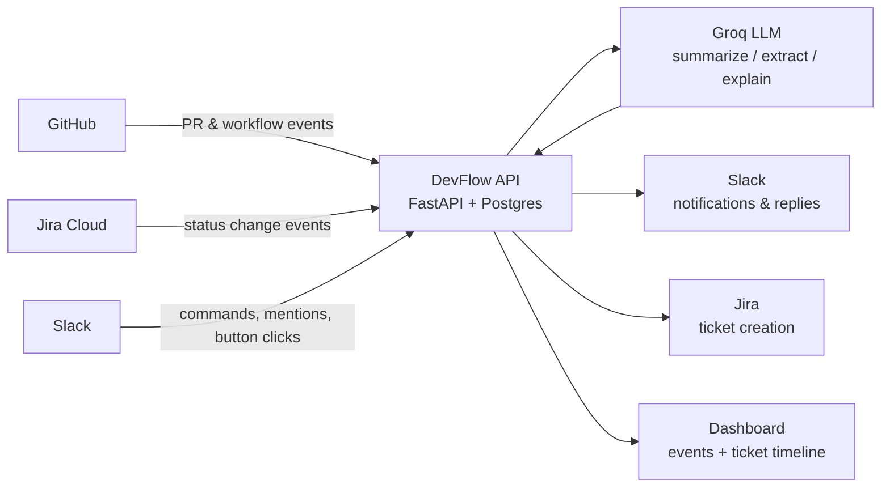
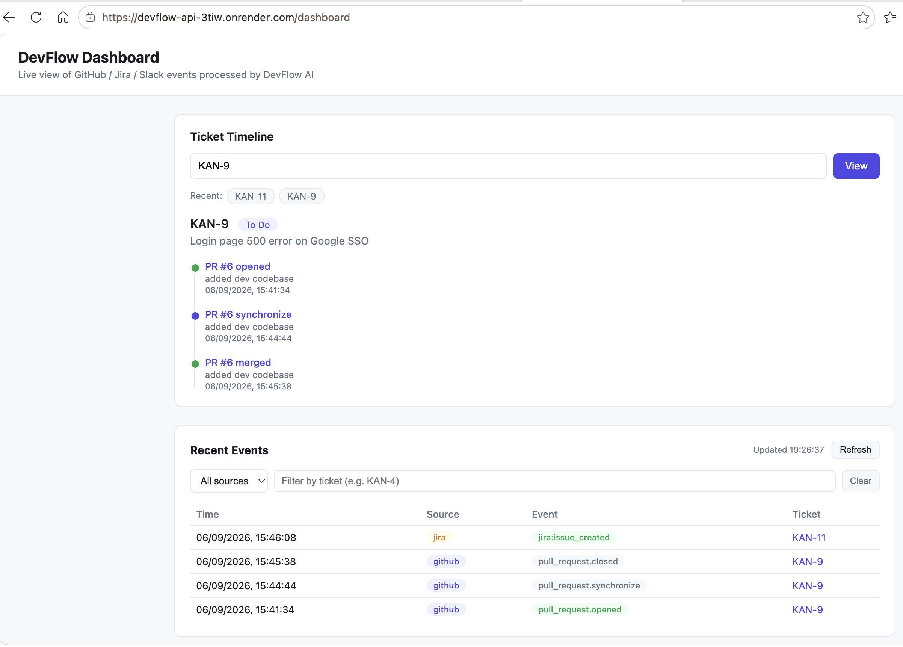
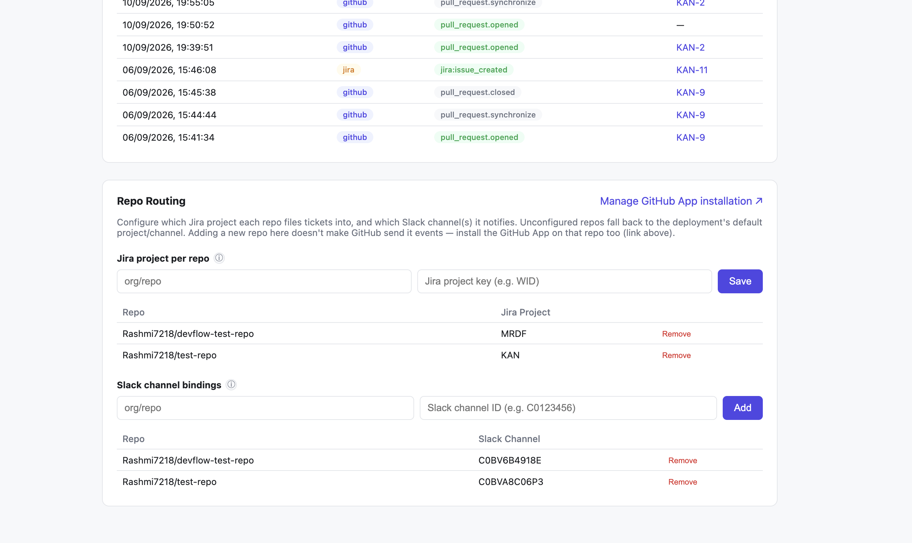
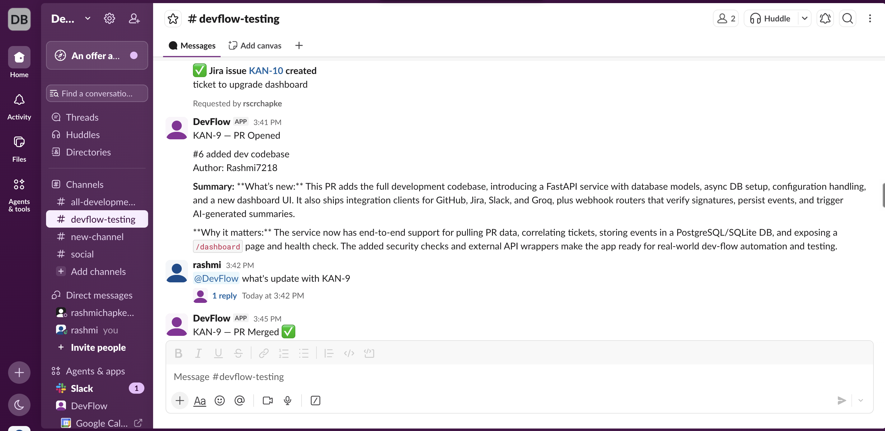
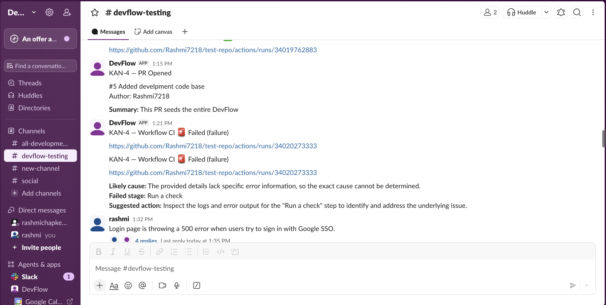
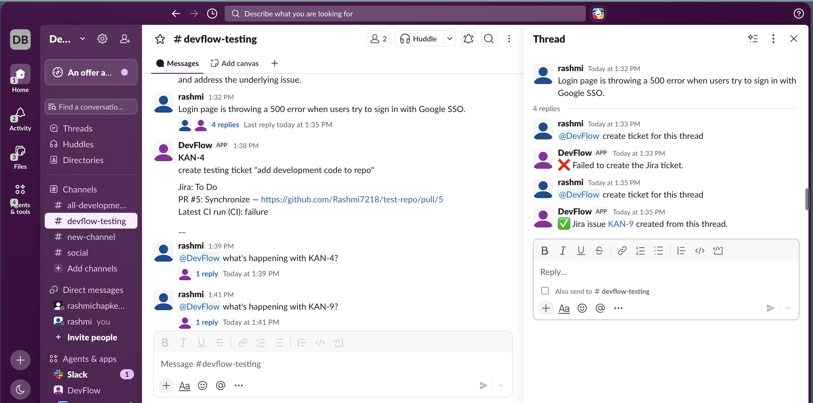
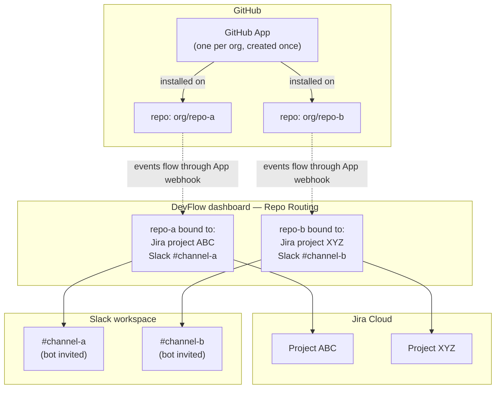

# DevFlow AI


[](LICENSE)

**Event-driven engineering automation that connects GitHub, Jira, and Slack — with an AI layer
that summarizes PRs, explains CI failures, turns Slack threads into Jira tickets (with human
approval), and answers natural-language status questions.**

🔗 **Live demo:** [devflow-api-3tiw.onrender.com](https://devflow-api-3tiw.onrender.com/dashboard)
*(free-tier hosting — sleeps after 15 min idle, first load may take ~30-50s to wake up)*

See [devflow-ai-project-idea.md](devflow-ai-project-idea.md) for the full product vision and
[RESOURCES.md](RESOURCES.md) for the account/API setup + deployment checklist.

## Highlights

- **Deterministic logic and AI logic are kept separate.** Ticket-key correlation, webhook
  auth, and event routing are plain code; the LLM (Groq) is only used for genuinely
  judgment-shaped tasks — summarization, structured extraction, and natural-language answers.
- **The AI layer degrades gracefully.** Every LLM call is wrapped so a Groq outage or bad
  response never breaks the underlying feature — a PR still gets posted to Slack even if its
  AI summary fails, with the failure fully logged, not swallowed.
- **Human approval on the one AI action with real side effects.** Turning a Slack thread into
  a Jira ticket shows an editable preview with Approve/Cancel buttons before anything is
  created — the AI drafts, a person confirms.
- **Webhook idempotency.** GitHub, Jira, and Slack all retry webhook deliveries on
  timeout/non-2xx responses in production; duplicate deliveries are detected by provider
  delivery ID and short-circuited before any Slack post, Jira write, or Groq call fires twice.
- **Two real integration bugs, fixed for real:** Slack's 3-second interaction timeout required
  redesigning the Jira-ticket flow to ack immediately and follow up via `response_url`; a
  reasoning-model token-starvation bug (Groq's `gpt-oss` spending its entire token budget on
  hidden reasoning and returning empty content) was fixed with `reasoning_effort: "low"`.
- **Tested at the right layer.** Prompt-construction and job/step-filtering logic is unit
  tested directly (mocking only the LLM call), while webhook integration tests cover full
  request→Slack/Jira round trips with all outbound HTTP mocked via `respx` — 94 tests, no
  live credentials needed, running in CI on every push.

## Architecture



## Reliability

Webhook deliveries are deduped by their provider-supplied delivery ID (`X-GitHub-Delivery` for
GitHub, `X-Atlassian-Webhook-Identifier` for Jira, `event_id` for Slack Events API) against a
`processed_deliveries` table (`app/idempotency.py`). A provider retry of an already-processed
delivery returns `{"status": "duplicate"}` immediately, without re-posting to Slack, re-creating
Jira tickets, or re-calling Groq — this matters because GitHub and Slack both retry webhook
deliveries on timeout/non-2xx responses in production.

Slack fan-out is fault-isolated per channel (`slack_client.post_to_channels`,
`app/integrations/slack_client.py`): a bound repo can notify several channels, and one channel
failing (bot not invited, channel deleted, Slack rate-limited) is logged and skipped rather than
raising — it doesn't 500 the whole webhook delivery, and it doesn't stop the other, correctly
configured channels from getting their notification.

## Screenshots

**Dashboard** — recent events feed + per-ticket timeline aggregating GitHub, Jira, and CI data


**Repo Routing** — bind each repo to a Jira project key and Slack channel(s) from the dashboard


**AI PR summary in Slack** — opened PR gets an AI-generated summary of what changed and why


**AI CI-failure explanation** — a failed workflow run gets a likely cause, failed stage, and
suggested next action, not just a red X


**Slack thread → Jira ticket (with human approval) + natural-language status queries**


## Setup

1. Work through [RESOURCES.md](RESOURCES.md) to create the Jira/Slack accounts and credentials,
   and — once, for the whole org — a GitHub App (permissions, webhook URL/secret, private key).
2. Copy `.env.example` to `.env` and fill in the values, including the GitHub App's ID, private
   key, and slug from step 1.
3. Start an ngrok tunnel: `ngrok http 8000` (or `ngrok http --url=<your-static-domain> 8000`)
   and point the GitHub App's webhook URL (set once, in the App's own settings — not per repo),
   the Jira webhook config, and the Slack event/command URLs at `https://<your-domain>/webhooks/github`,
   `/webhooks/jira?token=...`, and `/webhooks/slack/events` / `/webhooks/slack/commands`
   respectively.
4. Start Colima (Docker Desktop replacement): `colima start`. Then `docker compose up --build`
5. Check `http://localhost:8000/health`.
6. Browse recent events and per-ticket timelines at `http://localhost:8000/dashboard` — this
   (and everything under `/api/`) is gated by HTTP Basic Auth using the `ADMIN_USERNAME` /
   `ADMIN_PASSWORD` values from your `.env`.
7. Now connect GitHub repos, Jira projects, and Slack channels to each other — see "Connecting
   GitHub, Jira, and Slack" below.

For an always-on public deployment instead of local + ngrok, see "Deployment (Render)" in
[RESOURCES.md](RESOURCES.md) — `render.yaml` provisions the whole stack from one file.

For the full feature inventory, module-by-module code layout, architecture, and
known-limitations reference, see [DEVELOPERS.md](DEVELOPERS.md).

## Connecting GitHub, Jira, and Slack

Three separate accounts, three separate one-time setups, then a per-repo binding step that ties
them together. It's easy to do one of these and assume the others followed automatically — they
don't. This section is the full picture.

### The moving parts



Four independent things determine whether a repo's events actually reach the right place, and
**all four** are required — missing any one is exactly the kind of silent gap that's easy to hit:

1. **GitHub App installed on the repo.** No install → no events reach DevFlow at all (check via
   the App's **Advanced → Recent Deliveries** — see "Troubleshooting" below).
2. **Repo → Jira project binding** (dashboard "Repo Routing" → "Jira project per repo"). Without
   it, tickets created from this repo's Slack channel fall back to the deployment's default
   `JIRA_PROJECT_KEY`.
3. **Repo → Slack channel binding** (dashboard "Repo Routing" → "Slack channel bindings"). This
   is a *separate* binding from the Jira one above — binding the Jira project does not bind a
   Slack channel, and vice versa. Without a channel binding, notifications fall back to
   `SLACK_DEFAULT_CHANNEL`.
4. **The DevFlow bot invited to that Slack channel.** A binding pointing at a channel the bot
   hasn't joined fails outright (`not_in_channel`) rather than silently going nowhere.

### Onboarding a new repo — checklist

| # | Where | What to do |
|---|-------|------------|
| 1 | GitHub | Install the App on the repo — dashboard "Repo Routing" card → "Manage GitHub App installation ↗" → pick the repo (or confirm it's covered by "All repositories"). |
| 2 | Jira | Have (or create) a project for this repo, note its project key (e.g. `KAN`, `WID`) — Jira Admin → Projects, or create one straight from the "Create project" button. |
| 3 | Slack | Decide which channel should get this repo's notifications. Copy its **channel ID** (open the channel → channel name → "View channel details" → scroll down → "Copy channel ID", *not* the channel name — `chat.postMessage` needs the ID, something like `C0123456`). |
| 4 | Slack | Invite the bot to that channel: `/invite @DevFlow`. |
| 5 | DevFlow dashboard → Repo Routing | Under "Jira project per repo": add `owner/repo` → the project key from step 2. |
| 6 | DevFlow dashboard → Repo Routing | Under "Slack channel bindings": add `owner/repo` → the channel ID from step 3. |
| 7 | Verify | Open a test PR on the repo and confirm the notification lands in the channel you just bound — check that *specific* channel, not whichever one you assumed. Channel IDs (`C0123456`) don't read as channel names, so it's easy to check the wrong one. |

### Troubleshooting

- **Nothing in Slack, but the delivery in GitHub shows green ✅ / 200**: two possible causes,
  both now show the same green checkmark since Slack posting is fault-isolated per channel (see
  "Reliability" above) — a failure to post no longer fails the whole delivery:
  - You're looking at the wrong channel — re-check exactly which channel ID this repo is bound
    to in "Repo Routing", and look there specifically.
  - The bot isn't a member of the bound channel (or the fallback `SLACK_DEFAULT_CHANNEL`) —
    Slack's API error is `not_in_channel`. This only surfaces in the server logs now (search for
    "Failed to post to Slack channel"), not as a failed GitHub delivery — invite the bot and
    trigger a new event to confirm (redelivering the same event won't re-run the Slack post
    against a delivery ID it's already processed).
- **No delivery shows up in GitHub at all**: the App probably isn't installed on that repo —
  check `github.com/settings/apps/<your-app-slug>` → **Advanced** tab → **Recent Deliveries**
  (this is different from a classic repo-level webhook's own "Recent Deliveries" tab, if you
  still have an old one of those lying around from before this project switched to a GitHub
  App — delete it, otherwise you'll get duplicate notifications from two separate webhooks
  firing on the same event).

## Testing

```
pip install -r requirements-dev.txt
pytest -v
```

Tests run against an in-memory SQLite DB and mock all outbound HTTP (GitHub, Jira, Slack, Groq)
via `respx` — no live credentials or Docker needed. CI (`.github/workflows/ci.yml`) runs this
suite on every push/PR.

## Known limitations

- Events are processed inline in the webhook request, not via a queue/worker (Redis/Celery
  would be the next step for retry/backoff/DLQ semantics at higher volume).
- `pull_requests` / `workflow_runs` are append-only history rows rather than upserted by
  `(repo, number)` — simplest for now, revisit if "current status" queries need it.
- Jira webhook auth is a shared-secret query token, since Jira Cloud's built-in webhook UI
  doesn't support custom signing.
- No token/cost tracking on Groq calls, and no schema validation on the JSON the model
  returns beyond a bare `json.loads` (a malformed response fails safely but isn't retried
  with a stricter prompt).
- Admin auth is a single shared HTTP Basic username/password for the whole dashboard/admin API
  — no per-user accounts, no audit log of who changed a routing binding.
- Slack channel bindings are entered as raw channel IDs (copied from Slack) rather than picked
  from a list of channels the bot has joined — a `conversations.list`-backed picker is future
  work, not built in this pass.
- A Slack channel bound to multiple repos can't be disambiguated for ticket-creation flows; the
  first bound repo's Jira project is used and a warning is logged (see "Connecting GitHub,
  Jira, and Slack").
- The GitHub App's installation-token cache (`app/integrations/github_auth.py`) is in-process
  only — fine for the single-instance deployment this project runs as, but wouldn't be safe
  shared across multiple replicas without moving it to Redis/similar.
- If the GitHub App is uninstalled or suspended, GitHub events for the affected repos stop
  arriving silently — there's no detection/alerting for this today (see
  [DEVELOPERS.md](DEVELOPERS.md) for the full limitations list).
- A Slack channel that repeatedly fails to receive posts (bot removed, channel archived) fails
  silently from GitHub/Jira's point of view — it's logged (`app/integrations/slack_client.py`)
  but there's no alerting on repeated failures, so a misconfigured channel can go unnoticed
  until someone happens to check the logs or notices the missing notifications.

## License

[MIT](LICENSE)
